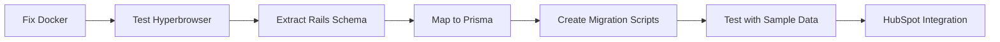

# Next Steps for BRX Platform Database Setup

## What We've Accomplished

1. ✅ Created the database architecture using Supabase (PostgreSQL) and Upstash (Redis)
2. ✅ Set up the Prisma schema for Exercise.com data
3. ✅ Created utility classes for database and cache operations
4. ✅ Updated the dashboard router to use real data
5. ✅ Created a seed script for initial data
6. ✅ Set up the environment configuration

## What You Need to Do Next

1. **Update Your Environment Variables**:

   - Edit `../v0-recreate-visual-design/.env.local` with your actual Supabase and Upstash credentials
   - Get your Supabase credentials from your Supabase project dashboard
   - Get your Upstash credentials from your Upstash Redis dashboard

2. **Push the Schema to Your Database**:

   ```bash
   cd ../v0-recreate-visual-design
   npx prisma db push
   ```

3. **Seed the Database**:

   ```bash
   cd ../v0-recreate-visual-design
   npx tsx prisma/seed.ts
   ```

4. **Start the Development Server**:

   ```bash
   cd ../v0-recreate-visual-design
   npm run dev
   ```

5. **Verify the Integration**:
   - Visit http://localhost:3000/dashboard
   - Check that the stats are loading from the database
   - Check the browser console for any connection errors

## Additional Resources

- [Supabase Documentation](https://supabase.com/docs)
- [Upstash Redis Documentation](https://docs.upstash.com/redis)
- [Prisma Documentation](https://www.prisma.io/docs)
- [Next.js Documentation](https://nextjs.org/docs)

If you encounter any issues, please refer to the `SUPABASE_UPSTASH_SETUP.md` file for detailed instructions or reach out for assistance.

# 🚀 Immediate Next Steps

## 1. Fix Docker Credentials (5 min)

```bash
./scripts/fix-docker-credentials.sh
```

## 2. Test Hyperbrowser (10 min)

```bash
./scripts/test-hyperbrowser.sh
```

Then in Claude, try:

- Navigate to https://online.brxperformance.com
- Take screenshot of login page
- Extract API endpoints

## 3. Extract Rails Data Structure (30 min)

### Using Hyperbrowser:

1. Login to online.brxperformance.com
2. Navigate to key pages:
   - User profile
   - Workout creation
   - Progress tracking
   - Settings/Admin

### Manual Inspection:

```bash
# Check browser DevTools
# Network tab → XHR filter
# Look for API calls like:
# - /api/v3/users
# - /api/v3/workouts
# - /api/v3/exercises
```

## 4. Create Rails API Wrapper (1 hour)

```typescript
// brx-app/lib/rails-client.ts
export class RailsClient {
  async getUsers() {
    // Implement Rails API calls
  }

  async getWorkouts(userId: string) {
    // Implement workout fetching
  }
}
```

## 5. Test Data Migration (2 hours)

```bash
# In brx-app directory
npm run db:import-brx
```

## 6. HubSpot Integration Planning (30 min)

### Quick Test:

1. Create HubSpot developer account
2. Get API keys
3. Test contact creation:

```javascript
// Test HubSpot API
const hubspot = require("@hubspot/api-client");
const client = new hubspot.Client({ apiKey: "YOUR_KEY" });

await client.crm.contacts.basicApi.create({
  properties: {
    email: "test@brxperformance.com",
    firstname: "Test",
    lastname: "User",
  },
});
```

## Key Questions to Answer:

1. **Do you have Rails console access?**

   - If yes → Direct data export
   - If no → API scraping needed

2. **What's your timeline?**

   - 2 weeks → Hybrid approach
   - 2 months → Full migration

3. **Budget for dual systems?**
   - Yes → Run parallel for safety
   - No → Aggressive migration

## Critical Path:



## If Hyperbrowser Still Fails:

### Alternative: Use curl/API exploration

```bash
# Get login token
curl -X POST https://online.brxperformance.com/users/sign_in \
  -H "Content-Type: application/json" \
  -d '{"user": {"email": "your-email", "password": "your-password"}}'

# Use token for API calls
curl https://online.brxperformance.com/api/v3/users \
  -H "Authorization: Bearer YOUR_TOKEN"
```

## Success Metrics:

- [ ] Docker credentials fixed
- [ ] Hyperbrowser working
- [ ] Rails API endpoints documented
- [ ] Data schema mapped
- [ ] Migration script created
- [ ] HubSpot test contact created

## Remember:

🎯 **Goal**: Get HubSpot integration live ASAP
🏗️ **Architecture**: Rails backend + Next.js frontend
💰 **Revenue**: Focus on $100K+ coaching clients
⚡ **Speed**: 2-week MVP for HubSpot sync
